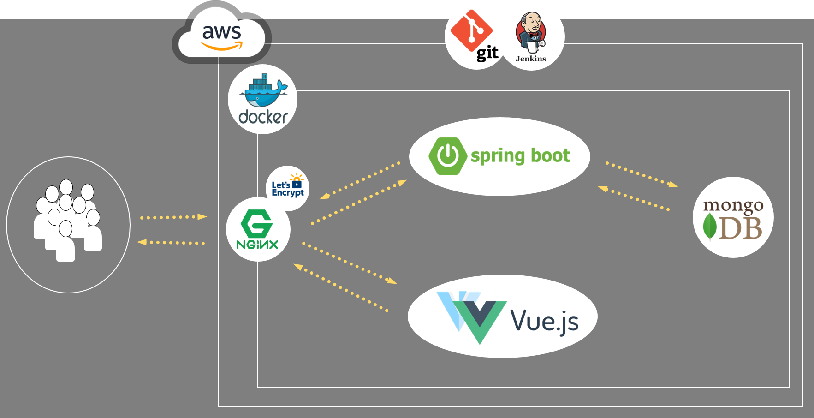

# 🌀 프로젝트 Lol body (League of Legend + Inbody)

## LoL body를 만든 이유

- 기존의 전적검색 사이트는 너무 무미건조 하고 **재미가없다!**
- 유저에게 신선하고 색다른 경험을 제공하기 위하여 제작

## LoL body의 특징

- 유저 개개인에게 Inbody 처럼 분석하여서 개개인의 성향 및 특징을 분석한다.

## LoL body가 지향하는 바

- 지속적인 CI/CD를 바탕으로 UX 향상 및 즐거움 선사.



## &#128640; 시작하기

- 프로젝트에 사용된 툴
  - Git
  - VisualStudioCode
  - Spring Tool Suite(STS)
  - mongoDB
  - Docker ( option )
  - AWS ( option )
  - Jenkinds ( option )
  - Nginx ( option )
  - Let's encrypt ( option )

```bash
$git clone <https://lab.ssafy.com/s03-webmobile1-sub3/s03p13b105>
```

### Front

```bash
# src 폴더에서,
# local에서 테스트하고 싶을 경우.

$cd front
$yarn install
$yarn serve

# 빌드시킬 경우,
$yarn build
```

### Backend

```bash
# mongoApi 폴더에서,
# Visual Stuido Code 기준 실행법
# mvn이 깔려져있는 것을 전제

$cd Back
$cd mongoApi

# 로컬에서 실행만 하고 싶은 경우,
$mvn spring-boot:run

# 빌드시킨 뒤 실행시키는 방법
$mvn package
$jar -jar target/*.jar
```

### 🚨 Style Guide (Front End)

1. class명 - kebab-case
2. id 명- camelCase
3. 변수명 - camelCase
   - 명시적으로 작성 필요
4. 함수명 - camelCase
   - 동사 - 명사 순서
   - ex) getApiData
5. 컴포넌트명 및 파일명 - PascalCase
6. App.vue는 컴포넌트 or router-view만 작성
7. 주소 참조는 @ 시작으로 통일
8. router에 의해 넘어가는 페이지는 views 그 외는 components 하위 폴더에 정리

## 롤바디 개발자 및 역할 분배

1.  👦 임승현(팀장)
   - 프론트엔드 및 배포
   - JS
   - Vue & Vuetify
   - Docker
   - AWS
   - nginx
2. &#128104; 김형래
   - 프론트엔드 및 CI/CD
   - JS
   - Vue & Vuetify
   - AWS
   - Jenkins
3. &#128113; 박진용
   - 백엔드 전담
   - Spring
   - mongoDB
   - Swagger
4. &#128115; 나호철
   - 데이터 분석 전담 및 프론트 엔드 보조
   - Python
   - Vue & Vuetify
   - Pandas
   - Numpy

## 프로젝트 후기

### Q. 감상평 한마디?

A. 👦 임승현

- AWS 서버를 활용하여 배포를 하여 실서비스를 운영하는 첫 경험이었습니다. 그만큼 어려운 부분도 많았고, 재밌는 부분도 많았습니다. 특히 이번 프로젝트를 통해  AWS, Docker, Nginx 등 새로운 기술에 대해서 배우고 적용해볼 수 있어서 좋았습니다. 또한 코로나라는 특수한 기간에 진행된 프로젝트인 만큼, Swagger 및 Jira, Git, mattermost, Webex 등의 협업 툴들을 더욱 더 효과적으로 활용할 수 있는 기회여서 너무 좋았습니다.

A. &#128104; 김형래

- 젠킨스, 지라, Nginx 등 처음보는 툴들을 많이 사용해볼 수 있는 프로젝트였습니다.

  vue를 제대로 사용해보는 것이 처음이라 많은 오류들을 보게되었는데 코치님들과 구글님의 도움 덕분에 프로젝트를 무사히 마칠수 있었던 것 같습니다.

A. &#128113; 박진용

- 백엔드를 전담으로 맡아서 역할을 수행했는데, 라이엇 API의 부정확함과 요청 개수의 한계, 데이터 처리 시간 등 어려움이 많았지만 아주 재미있었습니다. 팀원들이 에러 내역을 잘 전달해주고 컨설턴트님이 많은 부분을 조언 해주셔서 문제들을 잘 해결해낼 수 있었던 것 같습니다. 이번 프로젝트에서는 RESTful API를 제대로 제작해볼 수 있었고 이전에 사용해보지 않은 MongoDB를 접해볼 수 있었습니다. 처음 기술을 접하는 것은 어렵지만 그로 인하여 저의 실력이 성장할 수 있다는 것을 몸소 체험해볼 수 있어서 아주 좋은 성장의 기회가 되었던 것 같습니다.

A. &#128115; 나호철

* 사용자에게 우리가 원하는 정보를 제공하기 위해서 직접 API로부터 소스 데이터를 받아오고, 그 받아온 데이터에서 의미를 찾아내기 위해서 가공하고, 가공한 데이터를 바탕으로 사용자의 특성을 도출해내는 전 과정을 모두 해볼 수 있는 좋은 기회였습니다. 원래 원하는 만큼의 분석은 이뤄내지 못 했지만 더 빠르고 정확하게 분석을 할 수 있는 역량을 키운 것 같습니다.

### Q. 특별히 힘들었던 순간은?

A. 👦 임승현

- Vuex를 본격적으로 쓰면서 변화하는 데이터를 다뤄본적이 처음이라, 순간 순간 클릭 할 때마다 변화시켜야할때가 너무 어려웠습니다.(솔직히 지금도 잘모르겠긴합니다. 😵) 특히나, 불가피한 상황들이 겹치다보니, 촉박한 시간내에 로직들을 마무리해야했는데, 급한 마음에 코드도 정리가 안되고 로직도 뒤죽박죽이라 찾는데 너무 어려웠습니다. 다행히 팀원분이 도와주셔서 시간내에 잘 마무리 할 수 있게되어 좋았습니다.

A. &#128104; 김형래

- 페이지 엎고 다시해야했을때 멘탈... 😱

A. &#128113; 박진용

- 제 백엔드 파트너 어디가셨죠 &#128557;
- 라이엇 API는 믿을 수 없다
- Too Many Requests의 압박
- 노력한 것에 비해 보여지는 것이 별로 없다
- 하지만 프론트에서 백엔드의 부담을 덜어주셔서 무사히 끝낼 수 있었습니다.

A. &#128115; 나호철

* 데이터 수집을 위한 Datapipe line 제작할 때 힘들었습니다. API에서 보내주는 자료 형식이 아니라 내가 쓸 수 있는 방식으로 전환하고 저장하는데 시간이 오래 걸리고 문제가 발생하는 부분을 찾아내기 어려워서 고생을 좀 했고, 수집하는 데이터가 약 1000개 좀 넘는데 수집하는데 걸리는 시간이 1시간넘게 걸려서 오류가 발생하더라도 해결사항을 즉시 반영하기 어려웠습니다. 
* 또, 프로젝트의 기획이 약간 바뀌게 되면서 기존의 데이터 저장 방식을 CSV에서 mongodb로 바꾸고 저장하는 틀도 바뀌게 되면서 전체적으로 코드를 수정해야 할 일이 발생했는데 데티어의 수집부터 가공까지 모두 순차적으로 이뤄지기때문에 처음부터 끝까지 모두 손볼때 고생을 많이 한것 같습니다.

